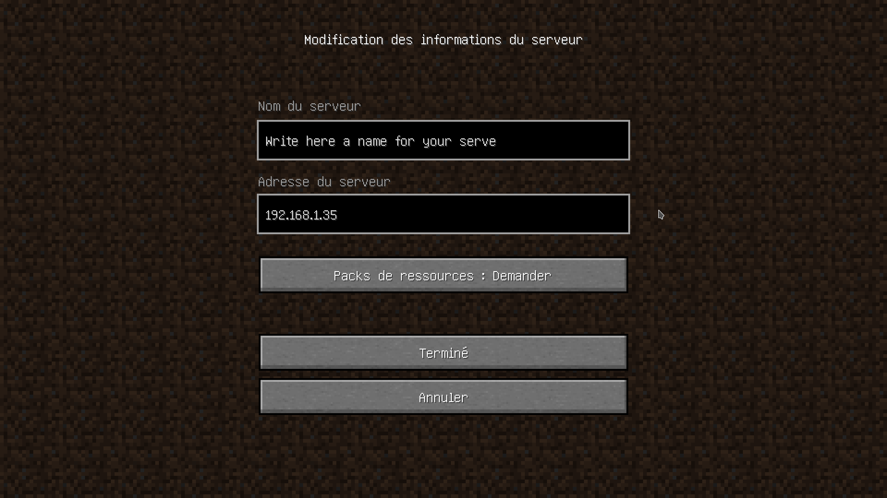

# Minecraft on linux

## Installation

[Page listing Links to various installers](https://www.minecraft.net/fr-fr/download/alternative).

## Wiki

[Wiki](https://minecraft.gamepedia.com/Minecraft_Wiki)

-[Crop farming](https://minecraft.gamepedia.com/Tutorials/Crop_farming)

## Host you own minecraft server


### Open the port dedicated to minecraft

```shell script
# Here, I open the port 25565.
sudo ufw allow 25565
```

### Redirect all incoming data from this port to your sever

You can skip this part if the server and all players are on the same local network.

This part varies depending on your Internet Service Provider.

#### Example : livebox

TODO : make an example of using the livebox


### Grab the server app

First of all, download the server application on this [official page](https://www.minecraft.net/fr-fr/download/server).

Place this file in a place which makes sense to you. Something like `~/servers/minecraft/`.

### Launch the server

```shell script
java -Xmx1024M -Xms1024M -jar server.jar nogui
```

... aaaaaaand it fails :

```log
[21:08:11] [main/ERROR]: Failed to load properties from file: server.properties
[21:08:12] [main/WARN]: Failed to load eula.txt
[21:08:12] [main/INFO]: You need to agree to the EULA in order to run the server. Go to eula.txt for more info.
```

Completely normal phenomenon. Just open the file `eula.txt` and change the parameter `eula` to `true`.

```shell script
nano eula.txt
```

```text
#By changing the setting below to TRUE you are indicating your agreement to our EULA (https://account.mojang.com/documents/minecraf>
#Mon Oct 12 21:08:12 CEST 2020
eula=true
```

Now, try again.

```shell script
# This one should work now.
java -Xmx1024M -Xms1024M -jar server.jar nogui
```

Wait for the instanciation to complete to 100%.

### Connection to the server

#### Access from the same local network

On your server, do a simple `ifconfig` :

```shell script
sudo apt install net-tools # Just in case ifconfig is not installed yet.
```

And then :

```shell script
ifconfig
```

This will give you something like that :

```log
user@serveur:~$ ifconfig
enp1s0: flags=4163<UP,BROADCAST,RUNNING,MULTICAST>  mtu 1500
        inet 192.168.1.35  netmask 255.255.255.0  broadcast 192.168.1.255
        inet6 aaaa:aaaa:aaaa:aaaa:aaaa:aaaa:aaaa:aaaa  prefixlen 64  scopeid 0x0<global>
        inet6 bbbb:bbbb:bbbb:bbbb:bbbb:bbbb:bbbb:bbbb  prefixlen 64  scopeid 0x0<global>
        inet6 cccc::cccc:cccc:cccc:cccc  prefixlen 64  scopeid 0x20<link>
        ether 70:85:c2:7d:4b:53  txqueuelen 1000  (Ethernet)
        RX packets 10649692  bytes 826189340 (826.1 MB)
        RX errors 0  dropped 870  overruns 0  frame 0
        TX packets 16813449  bytes 23084048410 (23.0 GB)
        TX errors 0  dropped 0 overruns 0  carrier 0  collisions 0

lo: flags=73<UP,LOOPBACK,RUNNING>  mtu 65536
        inet 127.0.0.1  netmask 255.0.0.0
        inet6 ::1  prefixlen 128  scopeid 0x10<host>
        loop  txqueuelen 1000  (Boucle locale)
        RX packets 86108  bytes 38613761 (38.6 MB)
        RX errors 0  dropped 0  overruns 0  frame 0
        TX packets 86108  bytes 38613761 (38.6 MB)
        TX errors 0  dropped 0 overruns 0  carrier 0  collisions 0

user@serveur:~$ 
```

You need the local address on the server. In this case, we have `192.168.1.35`.


You can now launch your minecraft game on your playing computer, go to multiplayer, click on `New server` and fill
up the two fields.



It will now appear in your list of server. Try to connect to it even if the game displays it as unreachable.

#### Access from the outside

Once again, you need the IP address of the server but this time, you want the public one. There are countless ways to
get it. In a desperate case, open a web page on the server to a website that can do it for you.
[https://www.whatsmyip.org/](Whatsmyip) is a good one.

When you have your server's public IP address, try to connect to it.
- launch you minecraft game
- click on ***multiplayer***
- click on ***new server***
- fill up the two fields. You can choose the name as you want, but the address is
***« ip_address:port_number_you_chose_at_beginning »*** (example : 90.124.65.32:25565)