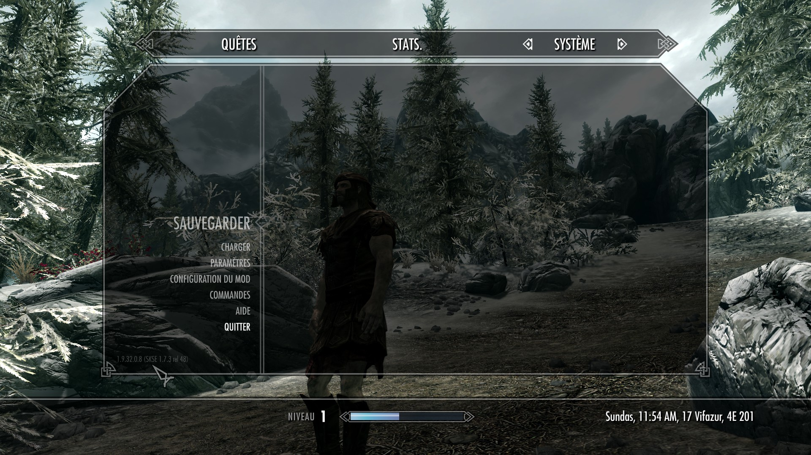

# The Elder Scrolls V : Skyrim (vanilla or special edition)

## Installation on linux (ubuntu 20.04)

### Steam (special edition only)

Add launch option *WINEDLLOVERRIDES="xaudio2_7=n,b" PULSE_LATENCY_MSEC=90 %command%* .

### My mod list

#### Mods requiring more steps

##### SKSE

- [Subscribe](https://store.steampowered.com/app/365720/Skyrim_Script_Extender_SKSE/) to the mod on steam.
- Wait for it to download and install in steam.
- Move to main game folder (`/path/to/steamapps/common/Skyrim`) and rename file `skse_loader.exe` to
`SkyrimLauncher.exe`
- Test the mod by launching the game (`Skyrim`) via steam. Look at the in-game-menu `Esc` or `Échap`, you should see the
interface informing you about your SKSE version.



##### SkyUI (not working on special edition)

- [Subscribe](https://steamcommunity.com/sharedfiles/filedetails/?id=8122) to the mod on steam.
- Wait for it to download and install in steam.
- Open the file `/path/to/steamapps/compatdata/72850/pfx/drive_c/users/steamuser/Local Settings/Application Data/Skyrim/plugins.txt`
Note that `72850` is the steam skyrim id.

```text
Dawnguard.esm
Dragonborn.esm
HearthFires.esm
HighResTexturePack01.esp
HighResTexturePack02.esp
HighResTexturePack03.esp
SkyUI.esp  <-- Ajoutez cette ligne. / Add this line.
unreadbooksglow.esp

```


#### Other mods installed


- [Augmente le cap maximal de vol à la tire jusqu'à 100](100 percent Max Pickpocket Chance)
- [Détecter les livres non lus]()