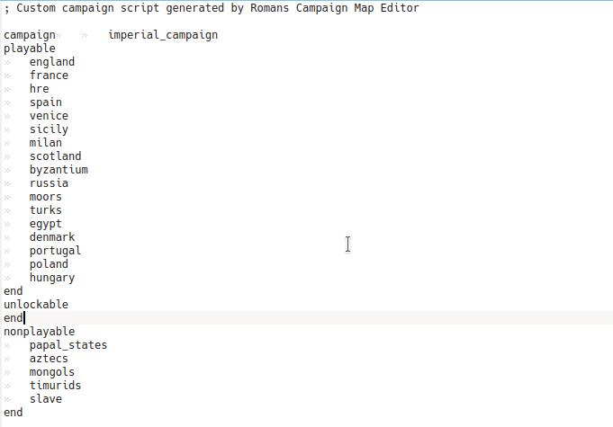

# Total War Medieval 2 (english)

[En français plus bas](total_war_medieval_2.md#total-war-medieval-2-franais)

## Tips

### Unlock all factions

Browse your game files and look for a file named `descr_strat.txt` which is either :
- (linux steam version) in the folder `YOUR_STEAM_FOLDER/Medieval II Total War/share/data/data/world/maps/campaign/imperial_campaign`
- (raw CD version via wine) dans le dossier `YOUR_INSTALL_FILE\SEGA\Medieval II Total War\data\world\maps\campaign\imperial_campaign`

Open this file and move the faction names from the `unlockable` block to the `playable` one.
In the end, your file should look like this :

For the extensions, the files are :

- Americas :
    * Steam : `GAME_FOLDER/Medieval II Total War/share/data/mods/americas/data/world/maps/campaign/imperial_campaign/descr_strat.txt`
    * Non-steam : `GAME_FOLDER\SEGA\Medieval II Total War\mods\americas\data\world\maps\campaign\imperial_campaign/descr_strat.txt`
- british_isles :
    * Steam : `GAME_FOLDER/Medieval II Total War/share/data/mods/british_isles/data/world/maps/campaign/imperial_campaign/descr_strat.txt`
    * Non-steam : `GAME_FOLDER\SEGA\Medieval II Total War\mods\british_isles\data\world\maps\campaign\imperial_campaign/descr_strat.txt`
- crusades :
    * Steam : `GAME_FOLDER/Medieval II Total War/share/data/mods/crusades/data/world/maps/campaign/imperial_campaign/descr_strat.txt`
    * Non-steam : `GAME_FOLDER\SEGA\Medieval II Total War\mods\crusades\data\world\maps\campaign\imperial_campaign/descr_strat.txt`
- teutonic :
    * Steam : `GAME_FOLDER/Medieval II Total War/share/data/mods/teutonic/data/world/maps/campaign/imperial_campaign/descr_strat.txt`
    * Non-steam : `GAME_FOLDER\SEGA\Medieval II Total War\mods\teutonic\data\world\maps\campaign\imperial_campaign/descr_strat.txt`

## Finding your saves

Your savefiles are located in : `~/.local/share/feral-interactive/Medieval II Total War/VFS/Local/saves`

## Problems

### Can't play in fullscreen

You can force fullscreen by deleting `~/.local/share/feral-interactive/Medieval II Total War/`. Be aware that this will
delete your savefiles (located there, see above), copy them in a safe place.
The next time you will launch the game, the game will rebuild those folders and files, quit the game and copy again your
savefiles to their origin emplacement.

# Total War Medieval 2 (français)

## Astuces

### Débloquer toutes les factions

Allez dans les fichiers du jeu et cherchez le fichier nommé `descr_strat.txt` qui se trouve :
- (pour la version linux de steam) dans le dossier `VOTRE_DOSSIER_STEAM/Medieval II Total War/share/data/data/world/maps/campaign/imperial_campaign`
- (pour la version non-steam via wine) dans le dossier `VOTRE_DOSSIER_D_INSTALLATION\SEGA\Medieval II Total War\data\world\maps\campaign\imperial_campaign`

Ouvrez ce fichier et déplacez les factions qui se trouvent dans la catégorie `unlockable` vers la catégorie `playable`.
Vous devriez avoir un fichier ressemblant à ceci :

Et pour les extensions ? Les fichiers à modifier sont ceux_cis :

- Americas :
  * Steam : `DOSSIER_DU_JEU/Medieval II Total War/share/data/mods/americas/data/world/maps/campaign/imperial_campaign/descr_strat.txt`
  * Non-steam : `DOSSIER_DU_JEU\SEGA\Medieval II Total War\mods\americas\data\world\maps\campaign\imperial_campaign/descr_strat.txt`
- british_isles :
  * Steam : `DOSSIER_DU_JEU/Medieval II Total War/share/data/mods/british_isles/data/world/maps/campaign/imperial_campaign/descr_strat.txt`
  * Non-steam : `DOSSIER_DU_JEU\SEGA\Medieval II Total War\mods\british_isles\data\world\maps\campaign\imperial_campaign/descr_strat.txt`
- crusades :
  * Steam : `DOSSIER_DU_JEU/Medieval II Total War/share/data/mods/crusades/data/world/maps/campaign/imperial_campaign/descr_strat.txt`
  * Non-steam : `DOSSIER_DU_JEU\SEGA\Medieval II Total War\mods\crusades\data\world\maps\campaign\imperial_campaign/descr_strat.txt`
- teutonic :
  * Steam : `DOSSIER_DU_JEU/Medieval II Total War/share/data/mods/teutonic/data/world/maps/campaign/imperial_campaign/descr_strat.txt`
  * Non-steam : `DOSSIER_DU_JEU\SEGA\Medieval II Total War\mods\teutonic\data\world\maps\campaign\imperial_campaign/descr_strat.txt`  

### Emplacement des sauvegardes

Vos sauvegardes se trouvent dans : `~/.local/share/feral-interactive/Medieval II Total War/VFS/Local/saves`

## Problèmes

### Factions muettes

Certaines factions ne produisent aucune parole, ce qui rend le jeu insipide. Les factions semblent être :
- l'Écosse
- la Russie
- le Danemark
- La Pologne
- la Hongrie

La solution est de télécharger deux fichiers que l'on mettra dans les dossiers du jeu pour remplacer celui qui est
défectueux.
- [events.dat](data/mute_factions/events.dat)
- [events.idx](data/mute_factions/events.idx)

Et placez-les tous deux dans le dossier `DOSSIER_DU_JEU/Medieval II Total War/share/data/data/sounds` pour la version
steam ou son dossier équivalent dans la version non-steam.

### Mauvais raccourcis clavier

Le jeu ne semble comprendre que les claviers `QWERTY`. Il vous faudra certainement refaire proprement vos raccourcis
clavier dans les paramètres.

### Impossible de jouer à Medieval 2 Total War en plein écran

Vous pouvez forcer une réinitialisation de vos paramètres en supprimant le dossier
`~/.local/share/feral-interactive/Medieval II Total War/`. Attention, cela supprimera vos sauvegardes : pensez à les
copier quelque part.
Lancez le jeu pour que celui-ci reconstruise son arborescence de fichiers et dossiers et vous n'avez plus qu'à remettre
vos sauvegardes à leur emplacement de départ.