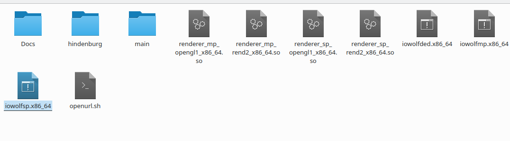

- [Installation](#installation)
  1. [Get the engine](#get-the-engine)
  2. [Get the data files](#get-the-data-files)
    * [You do have a legal version of the game](#you-do-have-a-legal-version-of-the-game)
    * [You do not have a legal version](#you-do-not-have-a-legal-version)
- [Launching](#launching)
- [Mod support](#mod-support)
  1. [Example of mod installation](#example-of-mod-installation)
# Installation

In order to play Return to Castle Wolfenstein, you need two things : the engine and the game files.

## Get the engine

Grab the files from [the releases page](https://github.com/iortcw/iortcw/releases). While I am writing, the last
release is the 1.51.c. Download it.

### Which file ?

I assume that you are a linux user (it's the point of this project), so you must choose one of the two linux files.

- `iortcw-1.51c-linux-x86.zip`
- `iortcw-1.51c-linux-x86_64.zip`
 
The first one will always work (but not always as efficiently as it could be). The second works only for 64 bits
processors (most recent PC).
In other words, if you have a r/d-ecent PC, pick the `[...]linux-x86_64.zip`. Otherwise pick the first one (for potato
computers).

Extract the archive where you want *Wolfenstein* installed. If you want to launch the game in single player mode,
use this commandes :

```shell script
cd path/to/your/wolfenstein/folder/ # This folder must contains two folders named Docs and main.
./iowolfsp.x86_64 # If you downloaded the second archive.
```

Aaaaaaaaaaaand it failed. Because you only have the engine files. Now you need to get the game data.


## Get the data files

You still need the game files, the .pk3 files.

For single players, the missing `.pak` files are :

- `pak0.pk3`
- `sp_pak1.pk3`
- `sp_pak2.pk3`
- `sp_pak3.pk3`
- `sp_pak4.pk3`

For multiplayer mode, you will ned those :

- `mp_pak0.pk3`
- `mp_pak1.pk3`
- `mp_pak2.pk3`
- `mp_pak3.pk3`
- `mp_pak4.pk3`
- `mp_pak5.pk3`

### You do have a legal version of the game

Install it somewhere.

* on your own linux computer using wine or steam
* on a windows system (then copy it on USB stick/GoogleDrive/whatever way you prefer)

Then copy the .pk3 files and paste them in the folder named _main_ of your engine.

### You do not have a legal version

Well... I am preparing something

TODO

# Launching

Juste execute the launcher :

```shell script
./iowolfsp.x86_64 # If you downloaded the second archive.
```

# Mod support

YES ! MODS ARE SUPPORTED !

Download your mod and place its folder in your game folder.

## Example of mod installation

We are going to download and install a mod from moddb.

Step 1 : Download the mod named Hindenburg on
[this page](https://www.moddb.com/games/return-to-castle-wolfenstein/addons/hindenburg-v11). You now have a file named
`hindenburg_v11.zip`.

Step 2 : Unzip it and place it in your ***main*** game directory.

Step 3 : Check all files are in order. You must have something looking like the picture below.


The `hindenburg` directory must contain only your two `.pk3` files.

Have fun !